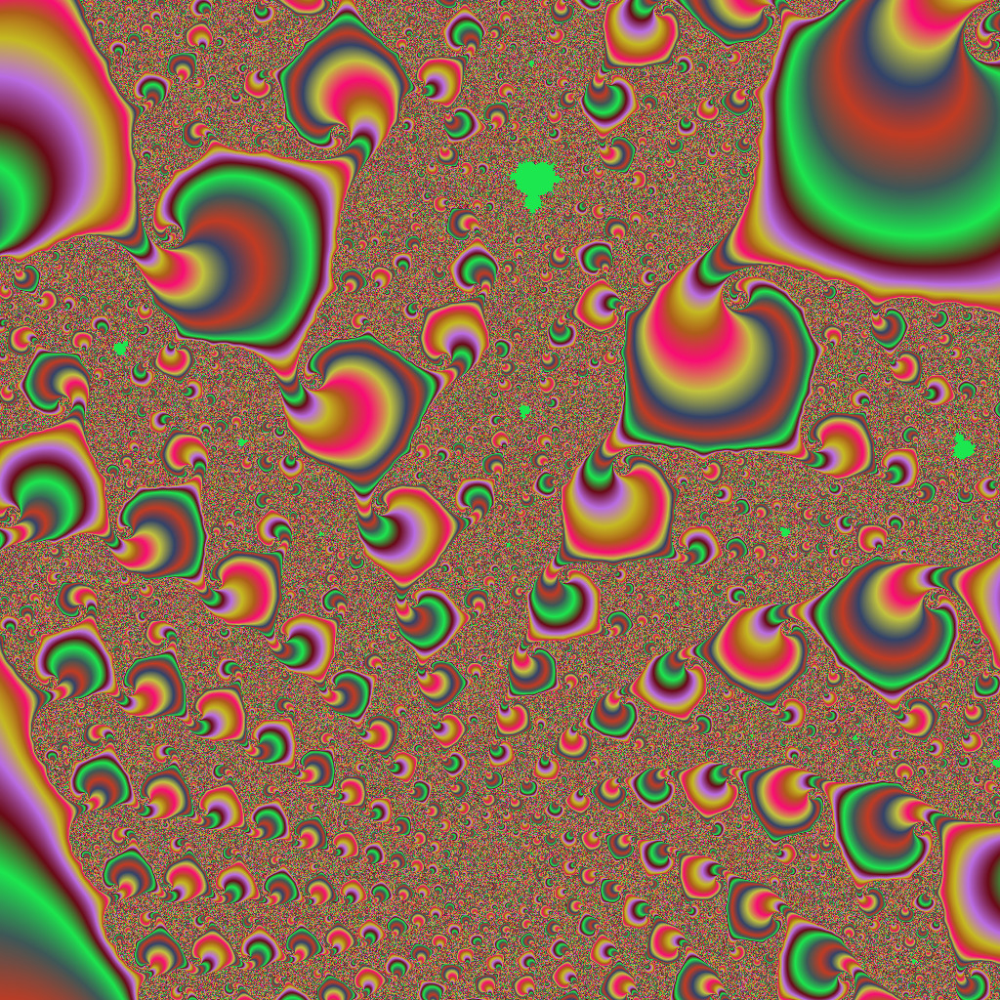

# fractalrender

fractalrender is a program that can render images and videos of the mandelbrot fractal, julia fractals, and more. It also includes a framework for people to write their own engines to generate images of fractals, supported dynamically at runtime.

It will also (still WIP) support an interactive viewer (using SDL).

fractalrender also plans to support Windows.


## Examples





## Usage

```
fractalrender v0.4.3
Usage: fractalrender [options] -o file...
Options:
  --help                     show help and exit
  -v <verbosity>             set verbosity to <verbosity> (vals are 0,1,2,3,4,5)
  -w <width>                 set image width to <width>
  -h <height>                set image width to <height>
  -i <iter>                  set max iterations to <iter>
  -z <zoom>                  set image zoom to <zoom>
  -x <center x>              set image center to <center x>
  -y <center y>              set image center to <center y>
        the center of the image is x + iy

  -c <color>                 set color scheme to <color>
  -E <color offset>          set color scheme offset to <color offset>
  -G <color scale>           set color scheme scale to <color scale>
  -s                         do simple colorizing
        if <color> is a file that ends with .color, the color scheme is read in.
        Otherwise, some builtins, such as `red`, `green`, `mocha`, and `random` can be used.

  -e <engine>                set compute engine to <engine>
  -p <prec>                  set precision to <prec>
  -P <prop>                  set prop library to <prop>
        This looks for libraries. If this is failing, try using `-e c` for the default engine.

  -A <args>                  set engine arguments to <args>
  -Z <zoomps>                set animation zoom per second to <zoomps>
  -F <fps>                   set animation frames per second to <fps>
  -S <sec>                   set animation length to <sec>
  -T <animtmp>               set animation temp file format to <animtmp>
        example: `-T ~/test/%d_out.png`, `%d` is replaced by the index of the frame

  -X                         launch interactive viewer
  -o <file>                  save image to <file>
        the extension determines which color I/O library to load.
        If your library is not loading, try using `.bmp` files


To report bugs, please email:
<group@chemicaldevelopment.us>
```

### Examples


`fractalrender -h` shows help

`fractalrender -o out.png` outputs `out.png`. This will look for the `libfrpng.so` file that should be built if libpng was found. If not, it will output an error.

`fractalrender -o out.bmp -v5 -w640 -h480 -x.2821 -y.01 -z10000 -i1000 -e complex -c example_sorbet.color` outputs `out.bmp` using the `complex` engine, and produces a lengthy output for debugging purposes.

`fractalrender -o out.mp4 -w640 -h480 -x.2821 -y.01 -z.01 -i1000 -F 25 -S 30 -Z 2.0 -e complex -c example_sorbet.color` outputs `out.mp4` which is an animation lasting `30` seconds, at `25` frames per second, and zooming in at a factor of `2.0` per second.

`fractalrender -X` will start an interactive viewer (still WIP)

`fractalrender -X -x.2821 -y.01 -z100 -v5` will start an interactive viewer at the specified coordinates and zoom, and print out lots of info in the console.


## Common Problems


 * P: When you run `fractalrender` after installation, it fails with: `fractalrender: error while loading shared libraries: libfrcommon.so.0: cannot open shared object file: No such file or directory`. S: run `sudo ldconfig`, or run locally like: `./src/fractalrender`


## Compiling

### From Development Sources

First, run `autoreconf -iv` to generate autotools files (`./configure`, etc).

Then, follow `From Release tarball` starting at the configure step.


### From Release tarball

First, untar/unzip your release and cd into it.

then, run `./configure && make && sudo make install`

This should autodetect libraries and do whatever is possible to build at the moment.

If you'd like to require support, use `--with-PKG`.

Example:

`./configure --with-png --with-sdl2` will require libpng and SDL to be found and built, or the configure script will fail.

You can also point them to non standard locations:

`./configure --with-png=$HOME/tmp/libpng-static-build`


Then, run `make && sudo make install`
